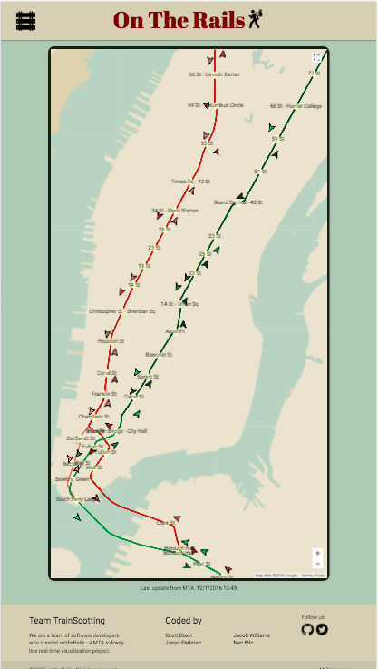
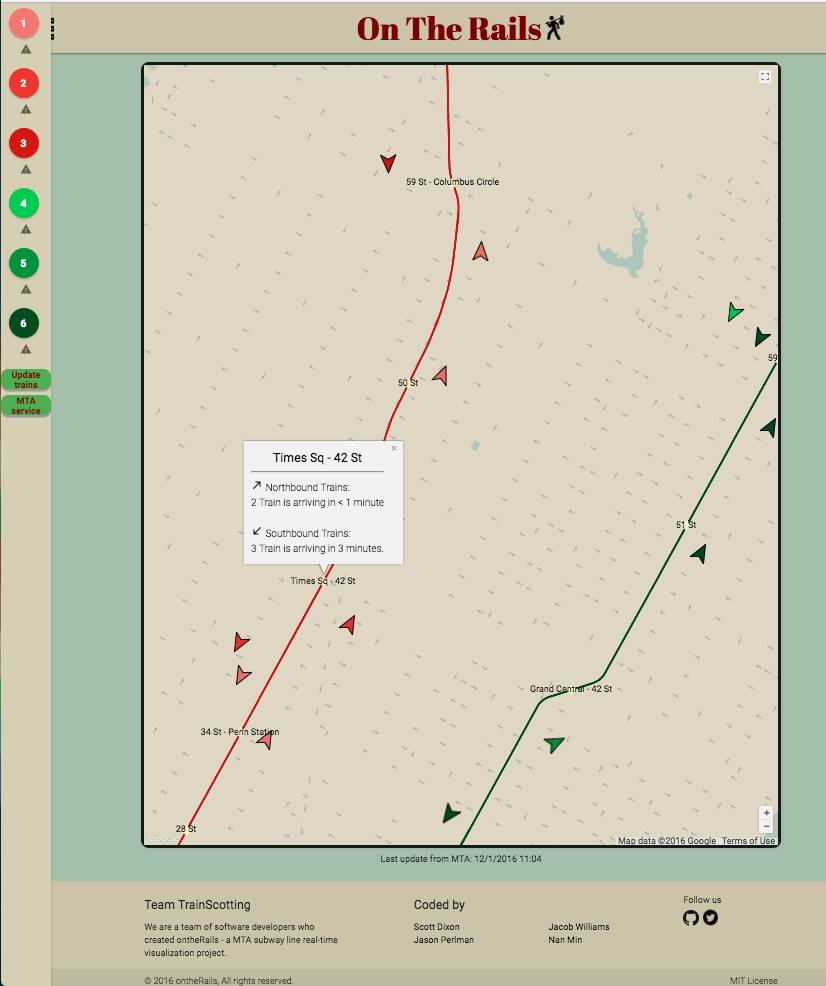

# On the Rails
### *A DBC Coyotes 2016 final project*

Deployed! [ontherails.herokuapp.com](https://ontherails.herokuapp.com) | [bit.ly/ontherails](https://bit.ly/ontherails)

### Coded by: Team TrainScotting
* [Scott Dixon](https://github.com/dixonrscott)
* [Jacob Williams](https://github.com/jacobgwilliams)
* [Nan Min](https://github.com/nanutza)
* [Jason Perlman](https://github.com/jpperlm)

### Description
*On the Rails* is a New York subway visualization app and provides users with real-time subway status information for the 1, 2, 3, 4, 5 and 6 lines. *On the Rails* uses the MTA's [real-time data feed API](http://datamine.mta.info/list-of-feeds) of those lines to provide specific train location and time information, as well as service status, e.g. on time or delayed.

*On the Rails* is mobile-friendly and fully functional for riders on the go.

### How to use the app
1. Upon landing on the app, a map of Manhattan displays six subway lines and the real-time location of trains on those lines. The map uses the Google Map API and can be zoomed in and out as well as dragged to show all parts of New York.
2. Tapping or clicking on the railroad menu icon brings up a side panel where users can toggle subway lines.
3. Specific train and station information can be viewed by tapping or clicking on the specific object.

